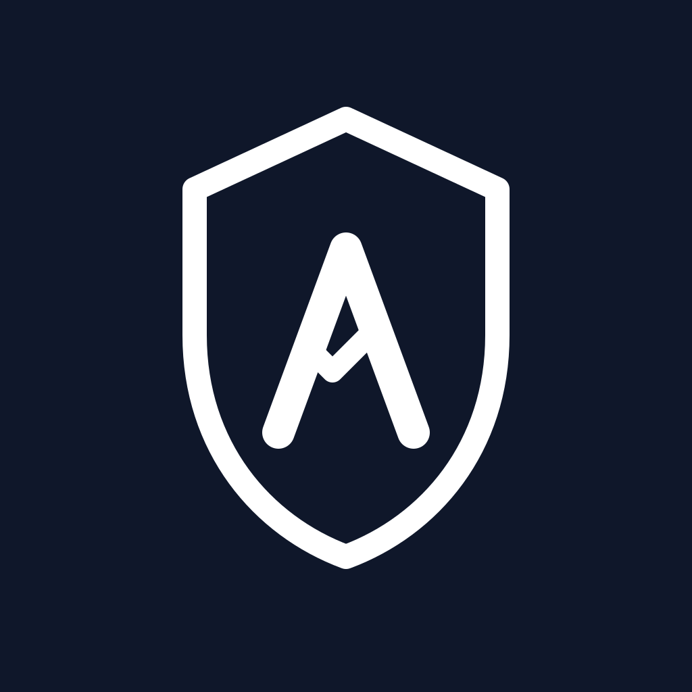

# ATLAS phd


**ATLAS (Assistant for Technical Learning & Attestation Support)** — агентный ассистент для подготовки к кандидатскому минимуму по технической специальности.

## Проблема

Подготовка к кандидатскому минимуму требует работы с большим объёмом разрозненных материалов (учебники, статьи, конспекты), а также регулярной самопроверки.

- Долго искать релевантные фрагменты вручную.
- Трудно проверять достоверность ответов и не «уходить» в галлюцинации.
- Нет быстрого цикла «изучил тему → проверил себя → получил обратную связь».

## Аудитория

- Аспиранты и соискатели по техническим направлениям.
- Пользователи, которым нужен ассистент по подготовке к техническому экзамену с опорой на источники и формулы.

## Агентный контур

Детерминированный агентный конвейер поверх RAG:

1. **Retrieval** — гибридный поиск (pgvector cosine + BM25 ts_rank → RRF) с фильтрацией по `tenant_id` (M4.A).
2. **Hard-gate (M3.A.0)** — на retrieval-уровне: при недостатке evidence (`top1_vscore < 0.55` ИЛИ `chunks_above_threshold < 2`) запрос отказывается **без LLM-вызова**, за <2s. Защита от галлюцинаций на off-topic. Сравнение M3.B: refusal_tnr **1.000 vs 0.000** vs baseline.
3. **Answer Node** — генерация ответа строго по найденным источникам, с обязательными inline `[Doc: <title>, p.<page>]` маркерами.
4. **Verifier (post-answer)** — проверка наличия citation markers; при провале — одна re-generation на том же retrieval.
5. **Self-check Generator + Evaluator** — RAG-заземлённая генерация вопросов (MC + open) и оценка по рубрике (correctness 40% / completeness 30% / logic 20% / terminology 10%). M3.A self-check rubric: **κ_binarized = 1.000** на бинарной классификации зачёт/незачёт.

Маршрутизация по режимам (`Q&A` / `Self-check`) — на уровне API-эндпоинтов.
Подробнее: [`docs/specs/agent-orchestrator.md`](docs/specs/agent-orchestrator.md).

## Стек

| Слой | Технология |
|---|---|
| API / Web UI | FastAPI + Jinja2 (web-first, Telegram бот отложен) |
| БД | PostgreSQL 16 + pgvector (HNSW partial-индексы per-tenant, cosine) |
| Embeddings | `paraphrase-multilingual-MiniLM-L12-v2` (384-dim, RU+EN, sidecar в Docker) |
| LLM | OpenRouter API. Default: `meta-llama/llama-3.3-70b-instruct` (paid, $0.10/M input). Free fallback с rate-limit: `meta-llama/llama-3.3-70b-instruct:free` |
| Multi-tenancy | M4.A: `tenant_id` на всех данных, JWT с `jv` claim (versioned), RBAC (super-admin / tenant-admin / supervisor / student), invite-flow, audit_log |
| Auth | JWT HS256, Argon2 пароли, jwt-version revocation (BDD 7.5) |
| Ingestion | JSONL (page-aware) / PDF / DOCX / TXT / MD |
| Eval-harness | M3 golden_set v1.1 (120 entries × 6 program topics), runner + score + per-topic breakdown |
| Деплой | Docker Compose; multi-stage Dockerfile (dev/production); GHCR image build via GitHub Actions |

## Что MVP НЕ делает (out-of-scope)

- Не покрывает все дисциплины и форматы (например, `djvu`).
- Не обещает production-SLA и высокую нагрузку.
- Не заменяет преподавателя и не принимает экзаменационные решения.
- Не строит продвинутую долгосрочную learning-аналитику.
- Telegram-бот отложен за пределы текущего MVP.

## Документация

### Концепция и требования

| Документ | Описание |
|---|---|
| [Product Proposal](docs/product-proposal.md) | Проблема, аудитория, ценностное предложение, бизнес-метрики |
| [Техническое задание v1.1](docs/technical_specification.md) | Полный scope системы, функциональные и нефункциональные требования |
| [Матрица требований](docs/requirements.md) | Трассировка FR/NFR → Use Cases → приёмочные тесты |
| [Use Cases](docs/use_cases.md) | UC-01 (Q&A), UC-02 (Self-check), UC-03 (Ingestion), UC-04 (Auth) |
| [Plan приёмочных тестов](docs/acceptance_tests.md) | AT-01..AT-25: сценарии, шаги, критерии прохождения |
| [Governance](docs/governance.md) | Реестр рисков, политики логирования и конфиденциальности |

### Архитектура и реализация

| Документ | Описание |
|---|---|
| [System Design](docs/system-design.md) | PoC-архитектура: модули, контракты, защитные механизмы |
| [Оркестратор и промпты](docs/specs/agent-orchestrator.md) | Граф выполнения Q&A и Self-check, системные промпты LLM |
| [Retriever](docs/specs/retriever.md) | Гибридный поиск (vector + BM25/RRF), evidence gate |
| [Web & API](docs/specs/web-and-api.md) | Эндпоинты FastAPI, UI-страницы, схемы запросов/ответов |
| [Memory & Context](docs/specs/memory-and-context.md) | Сессионная память Q&A, управление контекстом |
| [Ingestion](docs/specs/ingestion.md) | Пайплайн загрузки: accept → extract → chunk → embed → index |
| [Observability & Evals](docs/specs/observability-and-evals.md) | Структурированные логи, KPI-метрики, eval-harness |
| [Serving & Config](docs/specs/serving-and-config.md) | Docker Compose, переменные окружения, секреты |

### Диаграммы

| Документ | Описание |
|---|---|
| [C4 Context](docs/diagrams/c4-context.md) | Границы системы и внешние акторы |
| [C4 Container](docs/diagrams/c4-container.md) | Контейнеры: app, postgres, embeddings |
| [C4 Component](docs/diagrams/c4-component.md) | Внутренние компоненты backend |
| [Workflow Graph](docs/diagrams/workflow-graph.md) | Граф выполнения запросов и ветви ошибок |
| [Data Flow](docs/diagrams/data-flow.md) | Движение данных через систему |

## Локальный запуск

### Требования

- Docker Desktop (или Docker Engine + Compose plugin)
- OpenRouter API key ([openrouter.ai](https://openrouter.ai))

> **Apple Silicon (M1/M2/M3):** все образы собираются под `linux/arm64` — дополнительных флагов не нужно. Первая сборка embeddings-сервиса займёт чуть дольше из-за компиляции torch для arm64.

### 1. Переменные окружения

```bash
cp .env.example .env
# Заполнить: LLM_API_KEY, ADMIN_EMAIL, ADMIN_PASSWORD, JWT_SECRET
```

`.env.example`:
```
LLM_API_KEY=your_openrouter_key_here
# Paid (рекомендуется для пилота, без rate-limit'а):
LLM_MODEL_ID=meta-llama/llama-3.3-70b-instruct
# Free fallback (с rate-limit, годится для dev/smoke):
# LLM_MODEL_ID=meta-llama/llama-3.3-70b-instruct:free

POSTGRES_PASSWORD=atlas_dev

JWT_SECRET=change_me_in_production
ADMIN_EMAIL=admin@example.com
ADMIN_PASSWORD=changeme

LOG_LEVEL=INFO
VERIFIER_ENABLED=true   # M3 A/B toggle: false для baseline-режима
PILOT_TENANT_SLUG=optics-kafedra
```

### 2. Запуск

```bash
docker compose up -d
```

Поднимаются три контейнера: `postgres` (pgvector), `embeddings` (sentence-transformers sidecar), `app` (FastAPI).

> **Первый запуск занимает 5–10 минут** — Docker собирает образы и embeddings-сервис скачивает модель `paraphrase-multilingual-MiniLM-L12-v2` (~100 МБ). При повторных запусках всё кэшировано и стартует за секунды.

При старте `app` автоматически применяет все Alembic-миграции и создаёт admin-пользователя из `ADMIN_EMAIL` / `ADMIN_PASSWORD`.

### 3. Проверить готовность

```bash
docker compose logs -f app
```

Дождитесь строки `Application startup complete.` Это значит все три сервиса запущены.

### 4. Открыть интерфейс

```
http://127.0.0.1:8731
```

> Используйте `127.0.0.1`, а не `localhost` — некоторые сетевые конфигурации туннелируют `localhost` через внешний резолвер.

Войдите под `ADMIN_EMAIL` / `ADMIN_PASSWORD`.

### 5. Загрузить учебные материалы

Репозиторий включает демо-корпус в папке `corpus/` — три учебника по оптике (Born & Wolf, Матвеев, Yariv). Для быстрого старта загрузите их одной командой:

```bash
ADMIN_EMAIL=<ваш_email> ADMIN_PASSWORD=<ваш_пароль> ./scripts/seed_corpus.sh
```

Или вручную через UI:
1. Перейти на страницу **Материалы** (шестерёнка в навигации).
2. Загрузить файлы (PDF / DOCX / TXT / MD / JSONL).
3. Дождаться завершения ingestion-job — прогресс виден на странице.

После загрузки система готова отвечать на вопросы, строить самопроверки и цитировать источники.

### 6. Smoke-check

```bash
# Авто-тесты (требуется живой стэк):
python3 -m pytest tests/ -v   # 31 BDD test, время ~25s

# Eval-harness smoke (40 entries, ~10 мин):
ATLAS_EVAL_TOKEN=... python3 eval/runner.py \
    --set eval/golden_set_v1/golden_set_v1.0.jsonl \
    --config eval/configs/treatment.toml \
    --only refusal --only formula
```

Можно также пройти базовые сценарии из [`docs/acceptance_tests.md`](docs/acceptance_tests.md): `AT-01` (Q&A с цитатами), `AT-03` (отказ при отсутствии evidence), `AT-06` (самопроверка).

## Запуск пилота с друзьями

Если хочешь дать доступ 3–5 коллегам/аспирантам для тестирования — есть отдельный гайд для **local-пилота на твоей машине** (без VPS):
[`docs/deployment/local-pilot.md`](docs/deployment/local-pilot.md). Покрывает Tailscale / LAN / Cloudflare Tunnel / ngrok варианты сетевого доступа, bootstrap пилотного тенанта одной командой через [`scripts/pilot_seed.py`](scripts/pilot_seed.py).

Для **production-пилота на VPS** — [`docs/deployment/hetzner-setup.md`](docs/deployment/hetzner-setup.md).

## Разработка (hot-reload)

Команда та же:

```bash
docker compose up -d
```

`src/` и `alembic/` монтируются как volume; uvicorn запущен с `--reload` — изменения кода подхватываются без пересборки образа.

В production (GHCR image, target `production` в [`docker/app.Dockerfile`](docker/app.Dockerfile)) — без `--reload`, миграции делаются явным шагом через [`scripts/deploy.sh`](scripts/deploy.sh), не на старте контейнера.

## Эксплуатационные документы

| Документ | Описание |
|---|---|
| [`docs/runbook.md`](docs/runbook.md) | Day-to-day operations: health, restart, log-by-request_id, backup, rollback, типовые user-сообщения |
| [`docs/pilot/incident-runbook.md`](docs/pilot/incident-runbook.md) | Privacy / production / governance incident playbooks |
| [`docs/welcome/student.md`](docs/welcome/student.md), [`supervisor.md`](docs/welcome/supervisor.md), [`tenant-admin.md`](docs/welcome/tenant-admin.md) | Welcome-гайды для пилотных пользователей по ролям |
| [`eval/results/M3-report.md`](eval/results/M3-report.md) | Отчёт по M3.A/B/C: refusal_tnr, faithfulness, reproducibility, per-topic breakdown |
