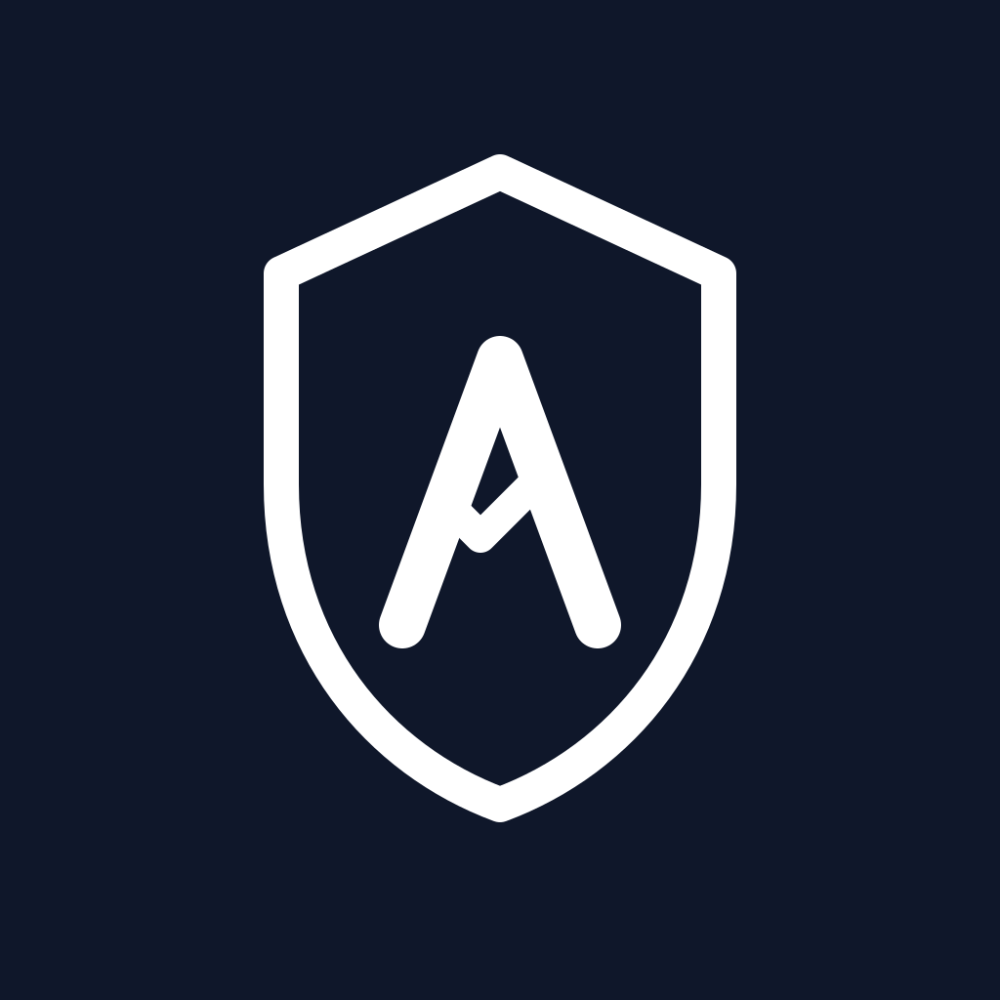
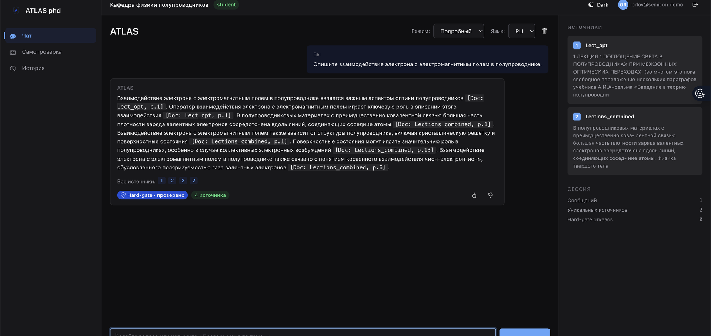

# ATLAS phd

[](CHANGELOG.md)
[](docs/design/screenshots/after/README.md#шаг-6--eval-dashboard-eval)
[](docs/design/screenshots/after/README.md#шаг-3--self-check-рубрика-self-checkhistoryopenattempt_id)
[](docs/design/screenshots/after/README.md#шаг-2--refusal-экран-off-topic-askкакова-численность-населения-москвы)

[](pyproject.toml)
[](src/atlas/api/)
[](alembic/)
[](docker-compose.yml)

**ATLAS (Assistant for Technical Learning & Attestation Support)** — агентный ассистент для подготовки к кандидатскому минимуму с **детерминированной защитой от галлюцинаций** и **валидированной экспертом self-check рубрикой**.


> **Главные результаты M3:** `refusal_tnr = 1.000` (vs baseline 0.000) — true negative rate на off-topic вопросах. `κ_binarized = 1.000` — agreement self-check рубрики с экспертной разметкой. Hard-gate latency p95 < 2s — отказ принимается на retrieval-уровне без вызова LLM.

---

## ✨ Что внутри

<table>
  <tr>
    <td width="25%"><a href="docs/design/screenshots/after/README.md#шаг-1--чат-с-цитатами-ask"></a></td>
    <td width="25%"><a href="docs/design/screenshots/after/README.md#шаг-2--refusal-экран-off-topic-askкакова-численность-населения-москвы"></a></td>
    <td width="25%"><a href="docs/design/screenshots/after/README.md#шаг-4--supervisor-heatmap-supervisor"></a></td>
    <td width="25%"><a href="docs/design/screenshots/after/README.md#шаг-7а--multi-tenancy-вторая-кафедра-в-работе"></a></td>
  </tr>
  <tr>
    <td><b>Q&A с inline-цитатами</b><br/>Ответы строго по корпусу, кликабельные `[N]` pills открывают точный фрагмент учебника.</td>
    <td><b>Hard-gate первого класса</b><br/>На off-topic вопрос система <b>детерминированно отказывает</b> до обращения к LLM, за &lt;2 сек.</td>
    <td><b>Кафедральный режим</b><br/>Heatmap по 6 топикам, privacy mask: 5 из 12 студентов anonymized как «Аспирант #N».</td>
    <td><b>Multi-tenancy</b><br/>Две кафедры (оптика + физика п/п) с изолированным retrieval. Студент semicon видит только semicon-источники.</td>
  </tr>
</table>

[**→ Полная аннотированная gallery 15 экранов**](docs/design/screenshots/after/README.md)

---

## 🎯 Проблема и аудитория

**Проблема.** Подготовка к кандидатскому минимуму требует работы с большим объёмом разрозненных материалов (учебники, статьи, конспекты), а также регулярной самопроверки.

- Долго искать релевантные фрагменты вручную.
- Трудно проверять достоверность ответов и не «уходить» в галлюцинации.
- Нет быстрого цикла «изучил тему → проверил себя → получил обратную связь».

**Аудитория.** Аспиранты и соискатели по техническим направлениям; научруки и кафедры, которым нужен ассистент по подготовке с опорой на источники и формулы.

---

## 🧠 Агентный контур

Детерминированный конвейер поверх RAG (граф оркестрации, не свободный tool-calling):

1. **Retrieval** — гибридный поиск (pgvector cosine + BM25 ts_rank → RRF) с фильтрацией по `tenant_id` (M4.A).
2. **Hard-gate (M3.A.0)** — на retrieval-уровне: при недостатке evidence (`top1_vscore < 0.55` ИЛИ `chunks_above_threshold < 2`) запрос отказывается **без LLM-вызова**, за <2s. `refusal_tnr = 1.000 vs 0.000 baseline`.
3. **Answer Node** — генерация ответа строго по найденным источникам с обязательными inline `[Doc: <title>, p.<page>]` маркерами.
4. **Verifier (post-answer)** — проверка наличия citation markers; при провале — одна re-generation на том же retrieval.
5. **Self-check Generator + Evaluator** — RAG-заземлённая генерация вопросов (MC + open) и оценка по рубрике (correctness 40% / completeness 30% / logic 20% / terminology 10%). `κ_binarized = 1.000` на бинарной классификации зачёт/незачёт.

Подробнее: [`docs/specs/agent-orchestrator.md`](docs/specs/agent-orchestrator.md), [архитектурные диаграммы C4](docs/system-design.md).

---

## 🚀 Быстрый старт (одна команда)

Полностью готовый demo-стенд с пользователями, попытками и реалистичными данными:

```bash
cp .env.example .env
# Заполнить: LLM_API_KEY (OpenRouter), JWT_SECRET, ADMIN_*

./scripts/seed_demo.sh
```

После завершения откройте `http://127.0.0.1:8731/login` и используйте демо-аккаунты:

| Роль | Email | Пароль | Что увидите |
|---|---|---|---|
| **student** | `ivanov@optics.demo` | `demo` | Чат + self-check + история |
| **supervisor** | `vasiliev@optics.demo` | `demo` | [Heatmap](docs/design/screenshots/after/06-supervisor-heatmap.png) 12 студентов × 6 топиков |
| **tenant-admin** | `admin@optics.demo` | `demo` | [Программа](docs/design/screenshots/after/07-tenant-admin.png) + материалы + инвайты |
| **super-admin** | `super@optics.demo` | `demo` | [Eval dashboard](docs/design/screenshots/after/08-eval-dashboard.png) + список кафедр |

Подробнее о каждой роли — в **[welcome/](docs/welcome/)**: [студент](docs/welcome/student.md) · [научрук](docs/welcome/supervisor.md) · [tenant-admin](docs/welcome/tenant-admin.md).

---

## 🛠 Стек

| Слой | Технология |
|---|---|
| Web UI | FastAPI + Jinja2 + 1 файл `atlas.css` (без билд-степа) |
| Дизайн-система | 18 BEM-компонентов · light + dark · brand-цвета из SVG `atlas-icon-v5-shield-no-ring-calm-blue` |
| БД | PostgreSQL 16 + pgvector (HNSW partial-индексы per-tenant, cosine) |
| Embeddings | `paraphrase-multilingual-MiniLM-L12-v2` (384-dim, RU+EN, sidecar в Docker) |
| LLM | OpenRouter API. Default: `meta-llama/llama-3.3-70b-instruct` (paid, $0.10/M input). Free fallback: `:free` suffix |
| Multi-tenancy | M4.A: `tenant_id` на всех данных, JWT с `jv` claim, RBAC (4 роли), invite-flow, audit_log |
| Auth | JWT HS256, Argon2 пароли, jwt-version revocation (BDD 7.5) |
| Ingestion | JSONL (page-aware) / PDF / DOCX / TXT / MD |
| Eval-harness | M3 golden_set v1.1 (120 entries × 6 program topics) |
| Деплой | Docker Compose; multi-stage Dockerfile (dev/production); GHCR image build via GitHub Actions |
| Security | Argon2 + JWT versioning · rate-limit на login (5+50 за 5 мин) и LLM-API (60/час) · CSP/HSTS/X-Frame-Options · log-masking PII/secrets · pip-audit в CI · non-root containers |

---

## 🔒 Безопасность

Полный обзор защитных механизмов: [`docs/security.md`](docs/security.md). Production-чеклист перед деплоем — там же.

Кратко:
- **Auth**: Argon2-пароли · JWT с `jv` claim для отзыва · constant-time login (нет user-enumeration по таймингу) · rate-limit 5/email + 50/IP за 5 мин.
- **Multi-tenancy**: tenant-резолвер с reject cross-tenant header'а · `assert_tenant_writable` для read-only/archived · audit_log на critical actions.
- **Web hardening**: CSP, HSTS (production), X-Frame-Options=DENY, X-Content-Type-Options=nosniff, Referrer-Policy, Permissions-Policy. TrustedHost + CORS опционально.
- **Upload**: лимиты 50 MB/файл, 200 MB/job, 50 файлов/job (`413` при превышении). Path traversal закрыт через `safe_filename` + `resolve()`-проверку.
- **LLM**: per-user квота 60 запросов/час (super-admin исключён). Prompt injection defense — chunks обёрнуты в `<<<DOCUMENT>>>` маркеры.
- **Логи**: автомаскирование `email`, `password`, `jwt`, `api_key`, `cookie` через structlog-процессор.
- **Контейнеры**: app и embeddings под non-root юзерами; postgres:5432 не публикуется наружу.
- **Зависимости**: `pip-audit` в CI (`--strict`) + dependabot weekly.

---

## 📚 Документация

📖 **Главная навигация:** [`docs/README.md`](docs/README.md) — структурированный TOC с reading paths по ролям.

Топ-3 starting points:
- 🎯 **[design/screenshots/after/README.md](docs/design/screenshots/after/README.md)** — аннотированная gallery 15 экранов с тезисами
- 🎬 **[design/demo-script.md](docs/design/demo-script.md)** — пошаговый сценарий защиты на 6 минут с inline-скриншотами
- 🏗 **[system-design.md](docs/system-design.md)** — обзор PoC-архитектуры с C4 диаграммами

---

## 🚫 Что MVP НЕ делает (out-of-scope)

- Не покрывает все дисциплины и форматы (`djvu`).
- Не обещает production-SLA и высокую нагрузку.
- Не заменяет преподавателя и не принимает экзаменационные решения.
- Не строит продвинутую долгосрочную learning-аналитику.
- Telegram-бот отложен за пределы текущего MVP.

---

## 💻 Запуск вручную (без seed-скрипта)

<details>
<summary>Развернуть пошаговую инструкцию</summary>

### Требования
- Docker Desktop (или Docker Engine + Compose plugin)
- OpenRouter API key ([openrouter.ai](https://openrouter.ai))

> **Apple Silicon (M1/M2/M3):** все образы собираются под `linux/arm64` — дополнительных флагов не нужно.

### 1. Переменные окружения
```bash
cp .env.example .env
# Заполнить: LLM_API_KEY, ADMIN_EMAIL, ADMIN_PASSWORD, JWT_SECRET
```

### 2. Запуск
```bash
docker compose up -d
```

Поднимаются три контейнера: `postgres` (pgvector), `embeddings` (sentence-transformers sidecar), `app` (FastAPI). Первый запуск ~5–10 мин (компиляция torch + скачивание модели), последующие — секунды.

### 3. Проверка
```bash
docker compose logs -f app   # дождаться "Application startup complete."
curl http://127.0.0.1:8731/health  # → {"status":"ok"}
```

### 4. Загрузка демо-корпуса
```bash
ADMIN_EMAIL=<ваш> ADMIN_PASSWORD=<ваш> ./scripts/seed_corpus.sh
```

Или через UI: страница [`/admin`](http://127.0.0.1:8731/admin) → загрузить PDF/DOCX/TXT/MD/JSONL.

### 5. Smoke-check
```bash
python3 -m pytest tests/ -v   # 31 BDD test, ~25s
```

</details>

---

## 🏃 Запуск пилота

- **Локально с друзьями** (3–5 коллег без VPS): [`docs/deployment/local-pilot.md`](docs/deployment/local-pilot.md). Покрывает Tailscale / LAN / Cloudflare Tunnel / ngrok.
- **Production VPS:** [`docs/deployment/hetzner-setup.md`](docs/deployment/hetzner-setup.md).

Операционные runbook'и: [day-to-day](docs/runbook.md), [incident playbook](docs/pilot/incident-runbook.md), [pilot timeline](docs/pilot/timeline.md).

---

## 🔧 Разработка (hot-reload)

```bash
docker compose up -d
```

`src/` и `alembic/` монтируются как volume; uvicorn запущен с `--reload` — изменения кода подхватываются без пересборки. Production target в [`docker/app.Dockerfile`](docker/app.Dockerfile) — без `--reload`, миграции через [`scripts/deploy.sh`](scripts/deploy.sh).

Дизайн-система — `/_/styleguide` (требует super-admin login). Все 18 компонентов в одном месте: [`src/atlas/static/atlas.css`](src/atlas/static/atlas.css) → [styleguide page](src/atlas/templates/_styleguide.html).

---

## 📜 История и метрики

- **CHANGELOG:** [`CHANGELOG.md`](CHANGELOG.md)
- **Release notes v0.8.0** (production UI + demo packaging): [`RELEASE_NOTES_v0.8.0.md`](RELEASE_NOTES_v0.8.0.md)
- **Release notes v0.7.0** (pilot-ready, M3.A–C + M4.5.E + M6.A): [`RELEASE_NOTES_v0.7.0.md`](RELEASE_NOTES_v0.7.0.md)
- **M3 отчёт** (refusal_tnr, faithfulness, repro): [`eval/results/M3-report.md`](eval/results/M3-report.md)
- **Eval results JSON:** [`eval/results/`](eval/results/) — все прогоны treatment / baseline / reproducibility
