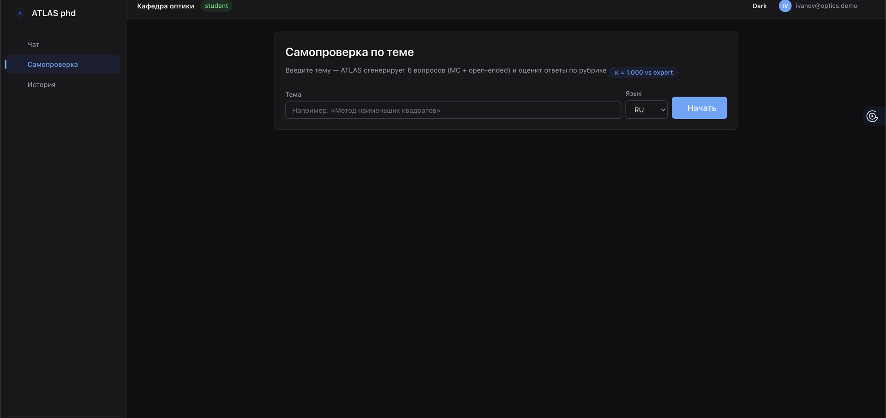
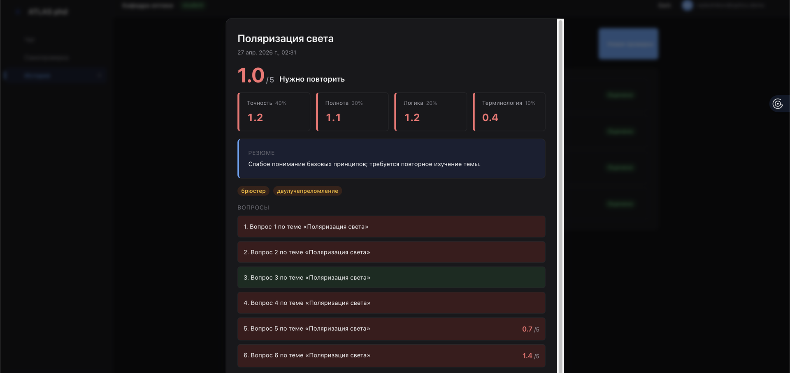
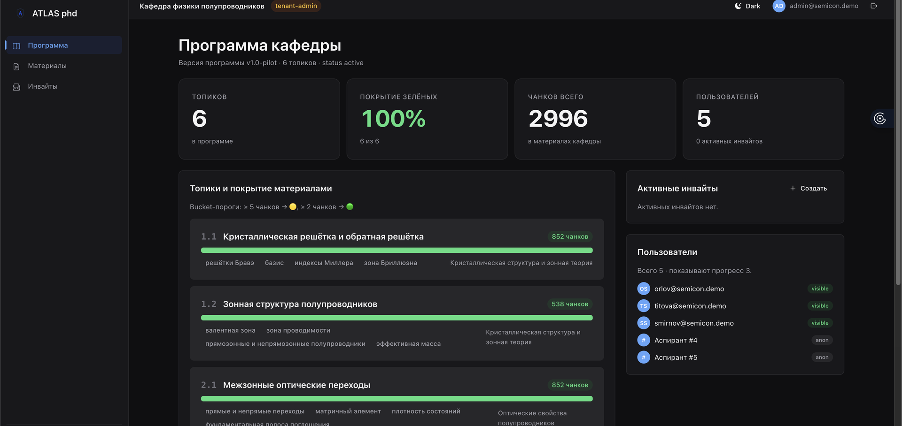

# Demo Script — сценарий повторной защиты

> **Версия:** 0.1 (2026-05-07)
> **Назначение:** этот документ определяет, **что именно** показывается на защите, в каком порядке, и какой тезис диссертации каждый шаг поддерживает. Он же даёт приоритизацию экранов: P0 (без него защита не работает) / P1 (усиливает) / P2 (опционально, если останется время).
> **Контекст:** [`docs/design-roadmap.md`](../design-roadmap.md) Фаза 1.

---

## 1. Каркас защиты (нарратив 5–7 минут)

| # | Шаг демо | Тезис | Длительность | Экран | Приоритет |
|---|---|---|---|---|---|
| 0 | Вход и landing | «Это система для подготовки к кандэкзамену с защитой от галлюцинаций» | 20 сек | Login + Landing/Hero | **P0** |
| 1 | Задаём корректный вопрос → получаем ответ с цитатами | RAG работает, источники проверяемы | 60 сек | `/` Чат → ответ + source-panel | **P0** |
| 2 | Задаём off-topic вопрос → срабатывает hard-gate | **Центральный тезис M3:** защита от галлюцинаций детерминирована, не «мы попросили модель быть осторожной» | 60 сек | `/` Чат → Refusal-экран | **P0** |
| 3 | Открываем eval-дашборд | **Главная цифра защиты:** `refusal_tnr 1.000 vs 0.000`, `κ_binarized 1.000` | 60 сек | `/eval` | **P0** |
| 4 | Запускаем self-check по теме → видим разбор по рубрике | Self-check заземлён в RAG, рубрика валидирована экспертом (κ=1.000) | 90 сек | `/self-check` → результаты | **P0** |
| 5 | Переключаемся на роль supervisor → heatmap студентов | Кафедральный режим: научрук видит прогресс, не текст ответов (privacy) | 60 сек | Supervisor dashboard | **P1** |
| 6 | Переключаемся на tenant-admin → программа + материалы | Платформа multi-tenant by design: новая кафедра = заполнить шаблон | 30 сек | Tenant admin | **P1** |
| 7 | Заключение: на этой архитектуре можно расширять корпус и направления | Eval-harness гарантирует, что качество не просядет | 30 сек | Eval-дашборд (повтор) | **P0** |

**Итого:** ~6 минут активного demo + 5 минут на вопросы по архитектуре.

---

## 2. Что нужно показать в каждом шаге

### Шаг 0 — Login + Landing

**Экран:** `/login`, потом `/` (главная сразу после входа).

**Что должно быть видно:**
- Бренд-логотип ATLAS (`shield-no-ring-calm-blue` из [`branding/`](../branding/)) на login-экране.
- Header после входа: tenant-context («Кафедра оптики ИТМО»), роль-badge («Студент»), email.
- Левый sidebar (если выбран этот паттерн) с пунктами Чат / Самопроверка / История.

**Что НЕ должно быть видно:**
- Лишних модалок, баннеров, accept-cookie.
- Пунктов меню, недоступных текущей роли (студент не должен видеть «Материалы»).

**Артефакты:** `templates/login.html` (новый), обновлённый `base.html` с tenant-context.

---

### Шаг 1 — Корректный вопрос с цитатами

**Экран:** `/` Чат.

**Сценарий:** ввести один из заранее подготовленных вопросов из demo-seed (Фаза 6). Пример: «Сформулируй принцип Ферма».

После клика на любой numeric pill открывается модалка с **полным фрагментом** учебника, на который опёрся ответ:

**Что должно быть видно:**
- Typing indicator с rotating steps (этот компонент уже есть, оставить).
- Ответ с inline numeric citations `[1] [2]` (новый паттерн вместо tail-list).
- Source-panel справа с чанками из Born&Wolf и Матвеева.
- Hard-gate badge «Проверено retrieval-gate» под ответом.

**Что НЕ должно быть видно:**
- Длинного списка источников в одну строку, обрезанного многоточием.
- «Полезно?» feedback-кнопок на демо (визуально шум, оставить только в обычном режиме).

**Артефакты:** обновлённый `chat.html` (inline pills + source-panel), новый компонент `CitationPill`.

---

### Шаг 2 — Off-topic → Refusal-экран

**Экран:** `/` Чат → Refusal-экран как first-class state.

**Сценарий:** ввести один из demo-seed off-topic вопросов. Пример: «Какова численность населения Москвы?» (явно не оптика).

**Что должно быть видно:**
- Шаги retrieval (`Ищу...`).
- Затем — **не серая карточка с красным span**, а полноценный экран:
  - Иконка щита (`shield-no-ring-calm-blue`) крупно.
  - Заголовок «Hard-gate: запрос отклонён».
  - Объяснение: «В корпусе кафедры не найдено достаточно доказательств для ответа».
  - Метрики: «Лучший vector-score: 0.31 (порог 0.55)», «Чанков выше порога: 0 (нужно ≥2)».
  - Тайминг: «Решение принято за 1.7 сек, без обращения к LLM».
  - Кнопка «Задать другой вопрос».

**Тезис, который читается с экрана:** *защита от галлюцинаций детерминирована и быстра, не зависит от того, попросили ли модель быть осторожной*.

**Артефакты:** новый компонент `RefusalScreen`; обновление `chat.html` для перехода на него вместо in-bubble.

---

### Шаг 3 — Eval-дашборд

**Экран:** `/eval` (новый).

**Что должно быть видно (3 hero-cards в верхнем ряду):**
1. **`refusal_tnr 1.000`** vs `baseline 0.000` — большая цифра, мини-bar, подпись «true negative rate на off-topic вопросах».
2. **`κ_binarized 1.000`** vs `baseline ~0.5` — подпись «agreement self-check rubric с экспертом».
3. **`< 2s`** для hard-gate decision — подпись «time-to-refusal без LLM».

**Под hero-row:**
- **Bar comparison per topic** (6 топиков из M4.5.E): `faithfulness baseline / verifier`. Видно, что verifier перекрывает baseline во всех топиках.
- **Per-topic table** с numeric breakdown (citation_accuracy, refusal_correctness, latency p50/p95).

**Тезис, который читается с экрана:** *цифры не из markdown-таблицы, а из работающей системы; их можно перезапустить и получить те же значения*.

**Артефакты:** новый шаблон `templates/eval.html`, новый router `eval.py` (читает результаты из `eval/runner.py` output JSON).

---

### Шаг 4 — Self-check: старт + разбор обоих исходов

**Экран:** `/self-check` (старт) → `/self-check/history?open=<id>` для готовой попытки.

**Сценарий 4а — старт:** logged in как `ivanov@optics.demo`, открыть `/self-check`. Вводим тему — система сгенерирует 6 вопросов из чанков учебников.

**Сценарий 4б — зачёт (4.7/5):** открыть готовую showcase-попытку ivanov на «Интерференция света».

**Что должно быть видно:**
- **Hero**: большой score (`4.7 / 5`), verdict «Отлично».
- **Rubric grid** (4 ячейки): Точность 4.8 / 5 (40%), Полнота 4.6 / 5 (30%), Логика 4.9 / 5 (20%), Терминология 4.5 / 5 (10%) — **с явным указанием весов**.
- **Per-question breakdown** с подсветкой правильного / неверного.
- **Evaluator summary** (1–2 предложения): почему такой score.
- **Бейдж «Rubric κ=1.000 vs expert»** — маленький значок, ссылающийся на eval-дашборд.

**Сценарий 4в — не зачёт (1.0/5):** открыть попытку `raskolnikov@optics.demo` на «Поляризация света» — verdict «Нужно повторить», все критерии в красном, error-теги «брюстер», «двулучепреломление».

**Тезис «не зачёт»:** система не маскирует слабый результат под средний — score 1.0 → однозначное «Нужно повторить», и студент получает не общую оценку, а **адресный фидбэк** через error-теги: ровно те понятия, по которым нужно вернуться к учебнику.

**Тезис, который читается с экрана:** *оценка self-check — не «галочка от LLM», а валидированная рубрика с экспертным согласованием. Бьёт зачёт/не зачёт так же, как эксперт (κ_binarized = 1.000)*.

**Артефакты:** обновлённый `selfcheck.html` (hero-зона + rubric-grid с весами + κ-badge).

---

### Шаг 5 — Supervisor heatmap

**Экран:** Supervisor dashboard (новый, `/supervisor`).

**Сценарий:** logout → login как supervisor (`vasiliev@optics.demo`). Открывается dashboard.

**Что должно быть видно:**
- **Sidebar**: Студенты / Программа / Материалы / Аудит.
- **Hero-row**: «Студентов: 12», «Активных за неделю: 9», «Средний score: 3.4», «Тем с покрытием < 60%: 2».
- **Heatmap**: студенты (12 строк) × топики (6 колонок). Заливка: зелёный → жёлтый → красный по последнему score; серый — не пробовал.
- **Drill-down**: клик на ячейку → показывается список попыток по теме (без текста ответов студента, только score, дата, evaluator_summary). Это и есть **M5 supervisor-privacy**.

**Тезис, который читается с экрана:** *кафедральный режим работает: научрук видит прогресс, но не вторгается в приватность ответов*.

**Артефакты:** новый шаблон `templates/supervisor.html`, новый router `web.py` маршрут.

---

### Шаг 6 — Tenant-admin: программа + материалы

**Экран:** Tenant-admin dashboard (новый, `/tenant-admin`).

**Сценарий:** logout → login как tenant-admin (`admin@optics.demo`).

**Что должно быть видно:**
- **Программа**: список топиков (6 из `M4.5`), для каждого — % покрытия корпусом (из `/{slug}/coverage`).
- **Материалы**: те же 3 учебника, но с привязкой к топикам.
- **Инвайты**: список активных кодов с copy-link (без раскрытия списка пользователей в скриншоте).

**Тезис:** *новая кафедра = заполнить программу + загрузить материалы + раздать инвайты. Платформенность реальна.*

**Артефакты:** `templates/tenant_admin.html`, `templates/tenant_admin/program.html`, `tenant_admin/materials.html`, `tenant_admin/invites.html` (или один шаблон с табами).

---

### Шаг 7 — Multi-tenancy proof: вторая кафедра в работе

**Экран:** `/_/tenants` (super-admin) → `/tenant-admin` (под semicon-admin) → `/` (под semicon-student).

**Сценарий:** показать что платформа multi-tenant не на бумаге.

**7а. Кросс-тенантный list** — две реальные кафедры:

**7б. Программа второй кафедры** — login `admin@semicon.demo`, открыть `/tenant-admin`. 6 топиков по физике полупроводников (01.04.10), 100% coverage из 4 PDF, 5 студентов.

**7в. Студент semicon в чате — изоляция retrieval'а живьём.** Login `orlov@semicon.demo`, спросить «Опишите взаимодействие электрона с электромагнитным полем в полупроводнике». Источники в ответе — **только** Lect_opt + Lections_combined (semicon-корпус). Born/Wolf/Matveev/Yariv (optics-корпус) недоступны.

**Тезис:** *multi-tenancy — не «слайд про возможности», а живой ответ системы. Студент одной кафедры физически не видит документов другой; retrieval жёстко фильтруется per-tenant через partial HNSW индексы.*

**Дополнительно:** dedicated `/_/invites` для управления приглашениями:

---

### Шаг 8 — Заключение (повторно eval)

**Экран:** `/eval` (см. скриншот в Шаге 3).

Ничего нового, повтор для якорения. Произносится: «Эти цифры — наш контроль качества. Любая регрессия видна; добавление новой кафедры (как мы сейчас сделали с физикой п/п) не требует изменения core-кода».

---

> 💡 **Полная аннотированная галерея скриншотов** (с тезисами и demo-сценарием для каждого) — в [`screenshots/after/README.md`](screenshots/after/README.md). Используется как «учебник» защиты для финальной сборки слайдов.

---

## 3. Приоритизация экранов

### P0 — без них защита не работает

| Экран | Шаг demo | Объём работы (грубо) |
|---|---|---|
| Login (отдельная страница, с брендингом) | 0 | S |
| `base.html` обновлённый (tenant-context, role-badge, sidebar) | 0 (везде) | M |
| Q&A с inline citations + source-panel + hard-gate badge | 1 | M |
| **Refusal-экран** как first-class | 2 | M |
| `/eval` дашборд | 3 | L |
| Self-check рубрика с hero + κ-badge | 4 | M |

### P1 — усиливают, но без них демо состоится

| Экран | Шаг demo | Объём работы |
|---|---|---|
| Supervisor dashboard + heatmap | 5 | L |
| Tenant-admin (программа + материалы + инвайты) | 6 | L |

### P2 — если останется время

| Экран | Назначение |
|---|---|
| Super-admin (список тенантов, аудит-лог) | Не нужен в demo-script, но добавляет глубину при вопросах |
| Onboarding via invite-code (отдельный flow) | Симпатично, но в demo-script не входит |
| Settings / Profile (visibility-настройки M5) | Только если будет вопрос про privacy |
| Styleguide `/_/styleguide` | Внутренний инструмент, не показывается комиссии |

### Что **не** в плане (и почему)

- **Mobile responsive**: комиссия смотрит на проектор/ноутбук, mobile-полировка не оправдана в этом цикле.
- **PDF-export self-check**: out-of-scope.
- **Сравнение двух попыток** студентом: не входит в нарратив диссертации.
- **`/qa` legacy экран**: удалить, не редизайнить.

---

## 4. Demo data, без которой ничего не работает

Это перенаправление в Фазу 6, но фиксируем здесь, чтобы Фазы 4–5 имели контракт на форму данных:

- **Тенант `optics-kafedra`** должен быть населён: 1 super-admin (есть), 1 tenant-admin, 1 supervisor, 12 студентов с реалистичными именами (например, «Иванов А. М.», «Петрова К. С.» — без `stu-xyz123@example.com`).
- **5–8 заранее подготовленных Q&A-сессий** с гарантированно красивыми ответами и ровно правильными цитатами.
- **2 заготовленных off-topic вопроса** — для шага 2 (refusal). Один по гуманитарной теме, один по инженерной, но не оптической.
- **2–3 self-check сессии** уже завершённых, чтобы при показе истории было что показать. Один с высоким score, один с partial.
- **Программа** в `optics-kafedra` — 6 топиков из `M4.5.E` уже есть в БД (надо проверить), но связки топик → материалы могут быть неполными.
- **Heatmap supervisor** — каждый студент должен иметь 2–4 попытки по разным топикам, чтобы heatmap был живым (не серым).

Если что-то из этого не реализуется в seed-скрипте — соответствующий шаг demo-script нужно либо упростить, либо вырезать.

---

## 5. Прогон сценария — checklist перед защитой

- [ ] Все P0-экраны имплементированы и проверены в dark mode.
- [ ] `seed_demo.sh` отрабатывает с одной команды и наполняет `optics-kafedra` ровно по этому документу.
- [ ] Прогон demo-script на ноутбуке + внешнем проекторе (контрастный мониторинг).
- [ ] Все 7 шагов укладываются в 6 минут.
- [ ] Подготовлен fallback на случай, если LLM зависнет: pre-recorded GIF одного из шагов.
- [ ] Hard-gate refusal-вопросы из шага 2 действительно отклоняются (повторный прогон через `/eval/run_eval.py`, чтобы убедиться).
- [ ] Все скриншоты для слайдов сняты заново после финальной полировки (Фаза 6).
