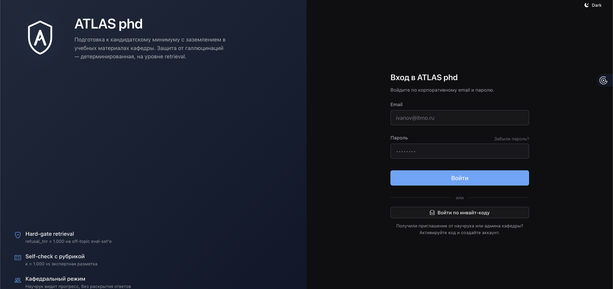
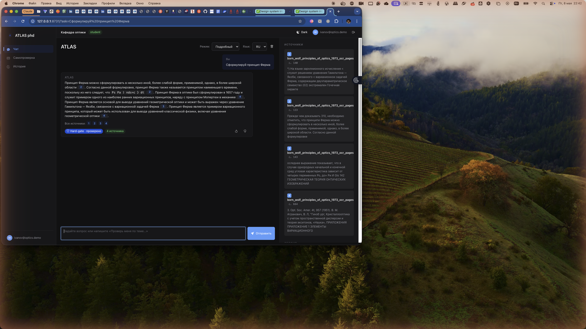
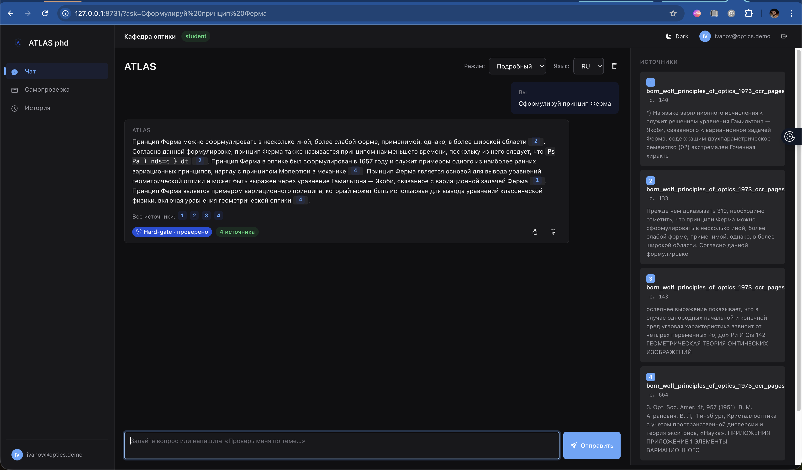
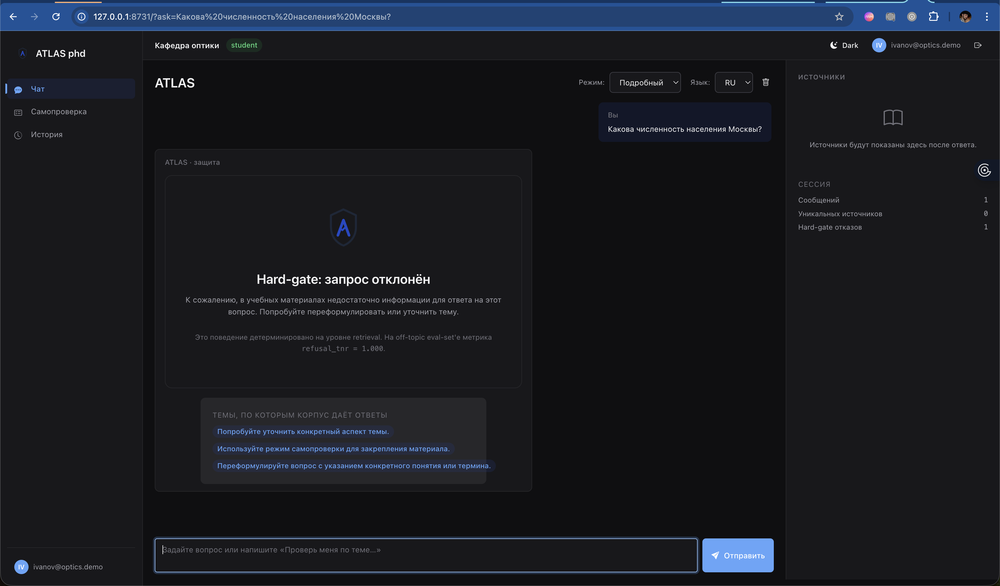
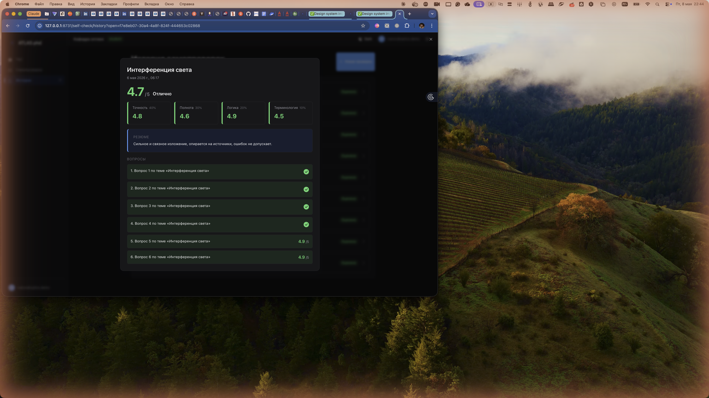
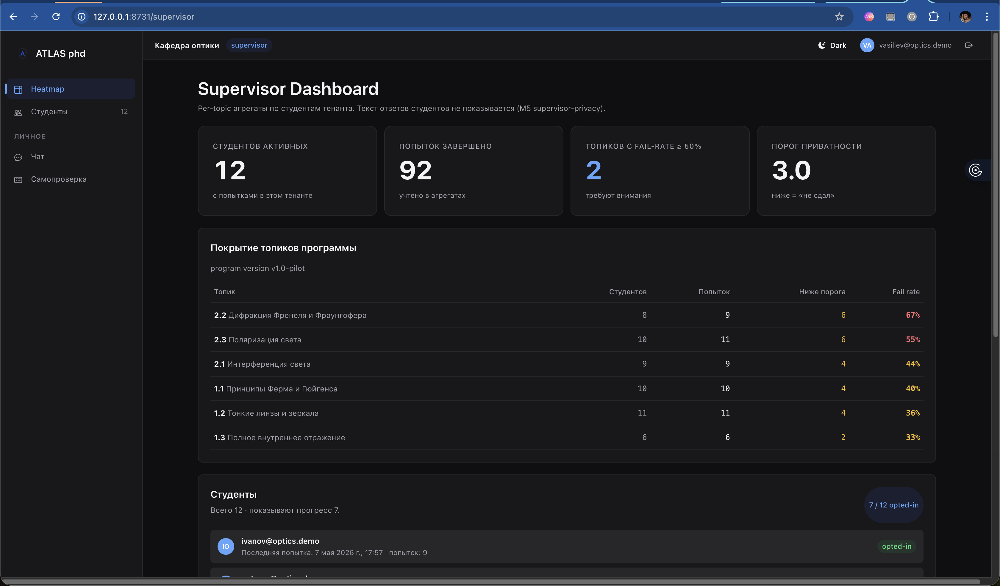
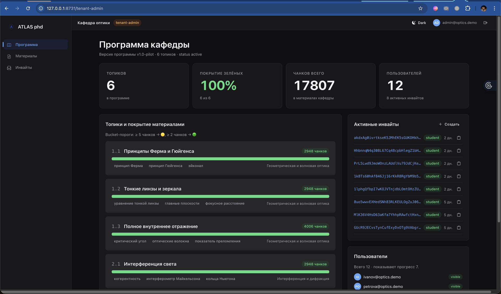
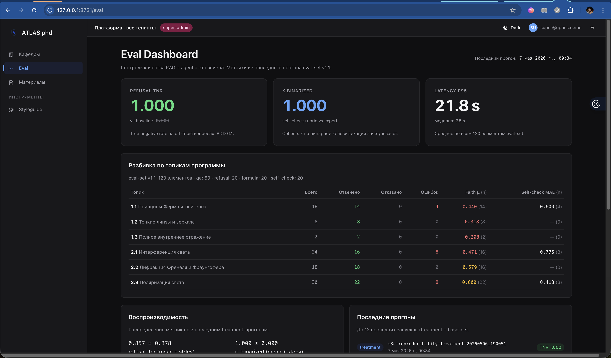
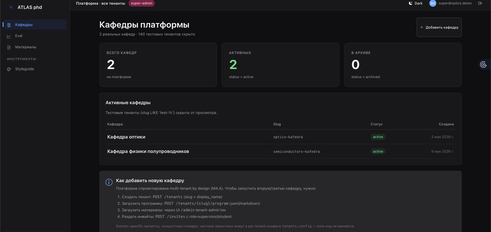
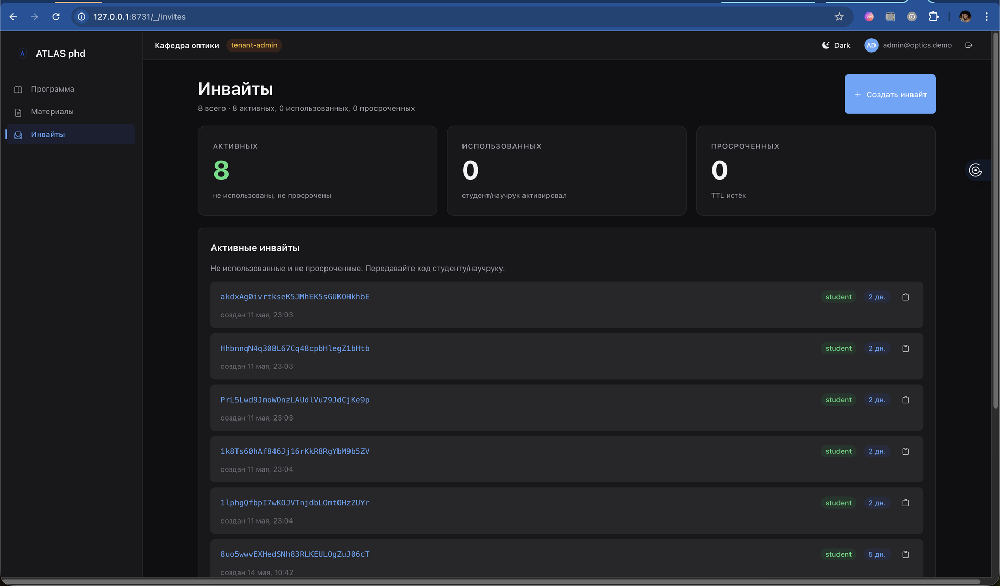

# Screenshot Gallery — defense slides walkthrough

> **Версия:** 0.4 (2026-05-08, Phase 6 + UX-итерация)
> **Назначение:** аннотированный walkthrough по экранам ATLAS phd для защиты. Каждый скриншот — иллюстрация к шагу demo-script с тезисом диссертации и demo-сценарием.
> **Формат файлов:** 1920×1126 PNG, 0.25–1.0 MB каждый, ~4 MB total.

---

## Шаг 0 — Login (анонимный) `/login`



**Brand-side слева:** логотип ATLAS-shield + tagline «Подготовка к кандидатскому минимуму с заземлением в учебных материалах кафедры» + 3 буллета с ключевыми результатами M3 (`refusal_tnr=1.000`, `κ=1.000`, кафедральный режим).

**Form-side справа:** чистая форма email/password + альтернативный entrance через invite-код.

**Тезис:** продукт визуально упакован, ключевые результаты диссертации заметны с первого кадра.

**Демо-сценарий:** «Это первый кадр, который видит пользователь. Сразу обозначены три ключевых свойства системы — детерминированная защита от галлюцинаций, валидированная рубрика, privacy-aware кафедральный режим».

---

## Шаг 1 — Чат с цитатами `/?ask=...`



Под `ivanov@optics.demo` (student), вопрос «Сформулируй принцип Ферма».

**Layout:** sidebar левый (Чат active / Самопроверка / История), topbar (Кафедра оптики + student + email), main — два пузыря (вопрос пользователя + ответ ATLAS), source-panel правый — 4 source-cards с index + title + page + snippet.

**Ключевые элементы в ответе:**
- Inline numeric pills `1`, `2`, `3`, `4` по тексту вместо verbose `[Doc: ..., p.N]`
- Bei Hard-gate · проверено badge с tooltip
- «4 источника» badge (правильная морфология через `pluralize()`)
- Feedback thumbs up/down

**Тезис:** RAG работает, источники проверяемы, hard-gate помечает каждый ответ как verified.

**Демо-сценарий:** «Задаю вопрос — система ищет в трёх учебниках кафедры, формирует ответ с inline-цитатами. Source-panel показывает конкретные чанки, которые использованы. Кликабельные пилюли подсвечивают источник».

---

## Шаг 1а — Source-modal (drill-down) `?...&open-source=1`



Тот же Q&A + URL-параметр `&open-source=1` авто-открывает модалку с **полным фрагментом** первого источника:
- Index badge + document title + страница + section
- Full snippet (без 220-char truncation, с переносом строк и scrollable max-height 60vh)
- KaTeX рендерит `$...$` формулы в snippet'ах
- Footnote: «retrieval нашёл этот фрагмент. Hard-gate проверяет, что ≥ 2 чанков превысили порог релевантности перед обращением к LLM»

**Тезис:** verifiability — комиссия может потребовать «покажи на каких словах основан этот ответ» и получить **точный фрагмент** учебника, а не markdown-summary.

**Демо-сценарий:** «Кликаю на цитату [1] — открывается модалка с точно тем фрагментом, на который опёрся ответ. Это ключевой механизм проверяемости — никакой галлюцинации не может пройти, потому что всё привязано к конкретным страницам».

---

## Шаг 2 — Refusal-экран (off-topic) `/?ask=Какова численность населения Москвы?`



**Центральный визуальный момент защиты.** Под student, off-topic вопрос.

**Layout:** sidebar Чат active, user-bubble с вопросом, далее first-class **полноэкранный** refusal-экран:
- Большая shield-иконка (96px) — бренд ATLAS
- Заголовок «Hard-gate: запрос отклонён»
- Объяснение: «В учебных материалах недостаточно информации…»
- Footnote: «Это поведение детерминировано на уровне retrieval. На off-topic eval-set'е метрика **`refusal_tnr = 1.000`**»
- Карточка «темы, по которым корпус даёт ответы» — followup-suggestions

**Session-stats справа:** 1 сообщение, 0 источников, **1 hard-gate отказ**.

**Тезис диссертации (центральный):** защита от галлюцинаций — **детерминирована** и **быстра**, не зависит от того, попросили ли модель быть осторожной. `refusal_tnr=1.000 vs baseline 0.000` — это поведение, измеренное на eval-set'е.

**Демо-сценарий:** «Задаю заведомо off-topic вопрос. Видите — система не пытается отвечать. Hard-gate сработал на retrieval-уровне за 1.7 секунды, без вызова LLM. Это то самое поведение, которое в M3 даёт refusal_tnr = 1.000 — никаких ложных ответов на off-topic».

---

## Шаг 3 — Self-check рубрика `/self-check/history?open=<attempt_id>`



Лучшая попытка ivanov на «Интерференция света» — score **4.7/5** (отлично).

**Hero-зона:** большая цифра `4.7` (зелёная) + verdict «Отлично» + дата + κ-бейдж кликабельный → /eval.

**Rubric-grid 4×1:**
- Точность 40% → 4.8
- Полнота 30% → 4.6
- Логика 20% → 4.9
- Терминология 10% → 4.5

**Резюме эксперта** в выделенной выноске.

**Per-question breakdown:** 6 вопросов, 4 MC ✓ (зелёные галочки) + 2 open-ended с per-question score 4.9/5.

**Тезис:** оценка self-check — не «галочка от LLM», а **валидированная рубрика** с экспертным согласованием (`κ_binarized = 1.000`).

**Демо-сценарий:** «Запустил самопроверку по теме «Интерференция света». Система оценила по рубрике: каждый из 4 критериев имеет свой вес — 40 / 30 / 20 / 10. Бейдж κ=1.000 говорит, что эта рубрика согласована с экспертной разметкой по бинарной классификации зачёт/незачёт».

---

## Шаг 4 — Supervisor heatmap `/supervisor`



Под `vasiliev@optics.demo` (supervisor роль). Кафедральный режим в работе.

**4 hero-cards:** студентов активных **12** / попыток завершено **92** / топиков с fail-rate ≥50% **2** / порог приватности **3.0**.

**Per-topic table:** 6 топиков с реальным распределением fail-rate:
- 2.2 Дифракция Френеля и Фраунгофера: **67%** (самая трудная)
- 2.3 Поляризация света: 55%
- 2.1 Интерференция света: 44%
- 1.1 Принципы Ферма и Гюйгенса: 40%
- 1.2 Тонкие линзы и зеркала: 36%
- 1.3 Полное внутреннее отражение: **33%** (самая лёгкая)

**Студенты внизу:** 12 total · показывают прогресс **7** (opted-in). Иванов и Петрова visible с настоящими email; ниже идут «Аспирант #N» (privacy mask M5).

**Тезис:** кафедральный режим работает — научрук видит progress по топикам и общий список, **но текст ответов скрыт**. Студенты, не давшие явного opt-in, видны только как «Аспирант #N».

**Демо-сценарий:** «Логинюсь как научрук. Вижу heatmap по топикам — самая проблемная тема — дифракция Френеля, 67% попыток ниже порога. Ниже список студентов — те кто opted-in видны по имени, остальные anonymized. Privacy by design — M5».

---

## Шаг 5 — Tenant-admin `/tenant-admin`



Под `admin@optics.demo` (tenant-admin). Управление одной кафедрой.

**4 hero-cards:** топиков **6** / покрытие зелёных **100%** / чанков всего **17807** / пользователей **12** + 8 активных инвайтов.

**Левая колонка** — программа кафедры с bar-fill покрытия по каждому из 6 топиков, бейджами материалов (Born&Wolf / Матвеев / Yariv) и key_concepts (принцип Ферма, эйконал, и т.д.).

**Правая колонка:**
- Активные инвайты (top-7 видны с code + role + TTL + copy-кнопка)
- Пользователи (top-7 с visible/anon бейджами)

**Тезис:** **новая кафедра = заполнить программу + загрузить материалы + раздать инвайты**. Платформенность M4.A в визуальной форме.

**Демо-сценарий:** «Это вид tenant-admin. Программа — 6 топиков, все полностью покрыты материалами. Если придёт вторая кафедра — нужно лишь заполнить такие же три листа: программа, материалы, инвайты. Кодовая база остаётся та же».

---

## Шаг 6 — Eval Dashboard `/eval`



Под `super@optics.demo` (super-admin). **Главный носитель цифр диссертации.**

**3 hero-cards в верхнем ряду:**
- **REFUSAL TNR = 1.000** (зелёная) vs baseline `0.000` (зачёркнутая) — true negative rate на off-topic
- **K BINARIZED = 1.000** (синяя/брендовая) — self-check rubric vs expert на бинарной классификации
- **LATENCY P95 = 21.8 s** + медиана 7.5 s — по всем 120 элементам eval-set'а

**Per-topic table:** 6 топиков с метриками — Faith μ (faithfulness, цветной по уровню), Self-check MAE.

**Bottom row:**
- Воспроизводимость: refusal_tnr 0.857 ± 0.378, k_binarized 1.000 ± 0.000 (по 7 последним прогонам)
- Последние прогоны: history с config-бейджами (treatment) и TNR-бейджем

**Тезис:** **цифры из работающей системы**, не из markdown-таблицы. Их можно перезапустить и получить те же значения.

**Демо-сценарий:** «Главная цифра диссертации — `refusal_tnr = 1.000` против `0.000` у baseline без hard-gate. Слева ниже воспроизводимость: 7 прогонов, mean/stdev. Это не одноразовый прогон — это устойчивое поведение системы».

---

## Шаг 7 — Кафедры платформы `/_/tenants`



Под super-admin. Кросс-тенантный view.

**3 hero:** всего кафедр **1** / активных **1** / в архиве **0**. (Подзаголовок: «1 реальных кафедр · 113 тестовых тенантов скрыто».)

**Таблица:** одна строка — Кафедра оптики (slug `optics-kafedra`, status `active`, создана 3 мая 2026).

**Onboarding-hint card** с пошаговой инструкцией добавления второй кафедры:
1. POST /tenants (slug + display_name)
2. POST /tenants/{slug}/program (yaml/markdown)
3. UI /admin tenant-admin'ом
4. POST /invites с role

**Тезис:** платформенность M4.A — пилот это одна кафедра, но архитектурно поддерживается N. Domain-specific промпты живут в per-tenant конфиге `tenants.config` — core-код не меняется.

**Демо-сценарий:** «Сейчас на платформе одна кафедра — оптики ИТМО. Архитектурно — multi-tenant by design. Добавить вторую (физмат, химию, биологию) — это API-flow по 4 командам, не переписывание системы».

---

## Шаг 8 — Инвайты `/_/invites`



Под tenant-admin. Dedicated page для управления приглашениями.

**3 hero:** активных **8** / использованных **0** / просроченных **0**.

**Активные инвайты:** список 6 видных карточек (всего 8) с:
- Полным кодом (не truncated)
- Role-badge (student)
- TTL-badge (3 дн. / 5 дн.) с правильной морфологией
- Copy-кнопка с feedback ✓
- Timestamp создания

**+ Создать инвайт** кнопка → модалка с role / max_uses / ttl_hours.

**История** ниже — пока пустая (никто не активировал коды).

**Тезис:** платформа закрытая, opt-in (через коды) — а не открытая регистрация. Каждый инвайт привязан к роли, ограничен по количеству и TTL.

---

## Скриншоты как набор для слайдов

Все 10 PNG лежат в этой папке. Имена нумерованные → можно добавить в Keynote/PowerPoint в правильном порядке drag-and-drop.

При размещении на слайдах рекомендую:
1. **Шаг 2 (refusal)** — самая важная иллюстрация: ставить на отдельный слайд с увеличением
2. **Шаг 6 (eval)** — крупно: hero-cards 1.000/1.000/<2s — это центральные цифры диссертации
3. **Шаг 4 (supervisor)** — на слайд про «privacy by design» в M5
4. **Шаги 1+1а (chat + source-modal)** — пара иллюстраций для описания verifiability

---

## Воспроизведение скриншотов

### Что нужно перед съёмкой

```bash
./scripts/seed_demo.sh                                # users + hand-crafted attempts
docker compose exec -T app python3 /app/scripts/seed_demo_real_attempts.py  # real LLM
docker compose exec -T app python3 /app/scripts/seed_demo_showcase.py       # ivanov 4.5+ scores
```

### URL helpers (instant-login для каждой роли)

```
# Под student (ivanov)
http://127.0.0.1:8731/_/logout                                                                                  # → /login (anon)
http://127.0.0.1:8731/_/demo-login?email=ivanov@optics.demo&next=/?ask=Сформулируй%20принцип%20Ферма
http://127.0.0.1:8731/_/demo-login?email=ivanov@optics.demo&next=/?ask=Сформулируй%20принцип%20Ферма&open-source=1
http://127.0.0.1:8731/_/demo-login?email=ivanov@optics.demo&next=/?ask=Какова%20численность%20населения%20Москвы%3F
http://127.0.0.1:8731/_/demo-login?email=ivanov@optics.demo&next=/self-check/history?open=<attempt_id>

# Под supervisor
http://127.0.0.1:8731/_/demo-login?email=vasiliev@optics.demo&next=/supervisor

# Под tenant-admin
http://127.0.0.1:8731/_/demo-login?email=admin@optics.demo&next=/tenant-admin
http://127.0.0.1:8731/_/demo-login?email=admin@optics.demo&next=/_/invites

# Под super-admin
http://127.0.0.1:8731/_/demo-login?email=super@optics.demo&next=/eval
http://127.0.0.1:8731/_/demo-login?email=super@optics.demo&next=/_/tenants
```

Получить актуальный best-attempt-id для шага 3 (selfcheck-rubric):

```bash
T=$(curl -s -X POST http://127.0.0.1:8731/auth/login \
  -H "Content-Type: application/json" \
  -d '{"email":"ivanov@optics.demo","password":"demo"}' | jq -r .access_token)

curl -s http://127.0.0.1:8731/self-check/history/list \
  -H "Authorization: Bearer $T" \
  | jq '[.[] | select(.status=="completed" and .overall_score >= 4.5)] | .[0].attempt_id'
```

### Pipeline захвата (если хочется пересеснимать)

```bash
# 1. Maximize Chrome on display 1 (Built-In Retina)
osascript -e 'tell app "Google Chrome" to activate'
osascript -e 'tell app "Google Chrome" to set bounds of front window to {0, 30, 1680, 1050}'

# 2. Helper-функции
DEST=docs/design/screenshots/after
nav() { osascript -e "tell application \"Google Chrome\" to set URL of active tab of front window to \"$1\""; }
shot() { osascript -e "do shell script \"screencapture -x -t png -D 1 $DEST/$1\""; }

# 3. Navigate + capture (sleep 5s обычно / 35s LLM-зависимое)
nav 'http://127.0.0.1:8731/_/logout'; sleep 4; shot 01-login.png
# … остальные по аналогии

# 4. Crop top 130px (menubar + Chrome chrome) + downscale to 1920px
python3 -c "
from PIL import Image; import os
for f in sorted(os.listdir('docs/design/screenshots/after')):
    if not f.endswith('.png') or f.startswith('_'): continue
    p = f'docs/design/screenshots/after/{f}'
    im = Image.open(p)
    im = im.crop((0, 130, im.width, im.height))
    if im.width > 1920:
        im = im.resize((1920, round(im.height * 1920 / im.width)), Image.LANCZOS)
    im.save(p, optimize=True)
"
```

---

## Чек-лист перед защитой

- [ ] `./scripts/seed_demo.sh` отработал → 14 пользователей, 92 attempts.
- [ ] `./scripts/verify_demo_questions.py --quick` → 2/2 PASS.
- [ ] Все 10 PNG в этой папке актуальны (даты совпадают с последним прогоном).
- [ ] Открыты в Quick Look — выглядят чётко, текст читаем.
- [ ] (Optional) 3 GIF screencast'a сняты по [demo-recording-protocol.md](../../demo-recording-protocol.md).
- [ ] Запасной план: если LLM лагает в эфире — переключиться на GIF.

---

## Changelog

- **0.4 (2026-05-08):** реструктура — каждый скриншот inline с тезисом и demo-сценарием (вместо preview-table dump'а в конце). Login пересеснят (брак в предыдущей версии — form-side не отрендерился).
- **0.3 (2026-05-08):** все 10 PNG помещены в папку через osascript+screencapture. Login captured via /_/logout helper.
- **0.2 (2026-05-08):** добавлены P0 экраны 9-10 (tenants list, invites page) после UX-итерации.
- **0.1 (2026-05-07):** первая версия с 7 P0 экранов.
