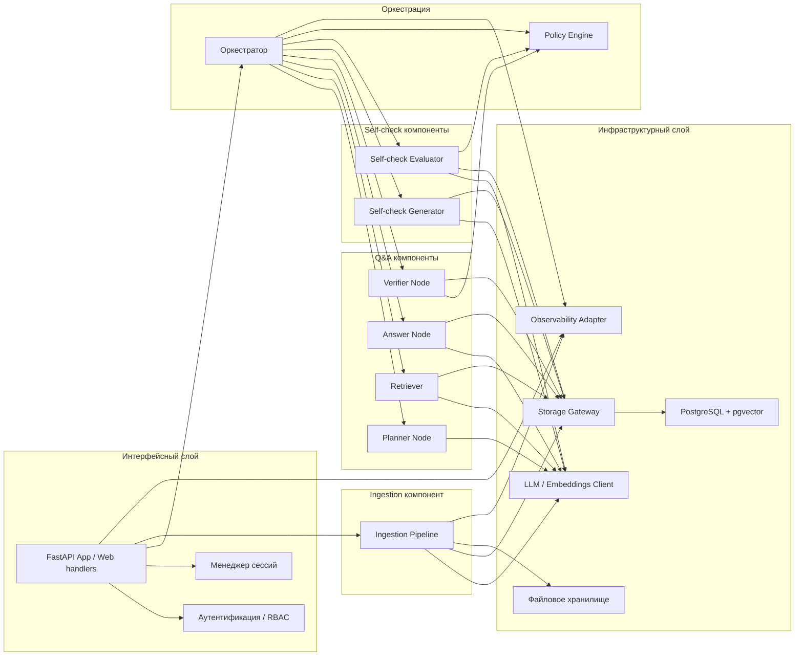

# C4 Component

Диаграмма показывает внутреннее устройство backend-ядра как набор компонентов и их зависимостей.
Она не отражает порядок выполнения шагов запроса; за это отвечает `Workflow Graph`.

