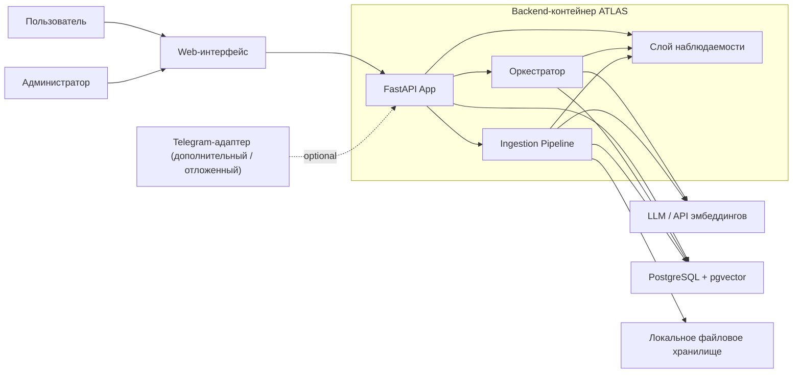

# C4 Container

Диаграмма фиксирует контейнерный уровень PoC. Система намеренно остается односервисной.

```mermaid
flowchart LR
    user["Пользователь"] --> web["Web-интерфейс"]
    admin["Администратор"] --> web

    subgraph app["Backend-контейнер ATLAS"]
        api["FastAPI App"]
        orch["Оркестратор"]
        ingest["Ingestion Pipeline"]
        obs["Слой наблюдаемости"]
    end

    web --> api
    api --> orch
    api --> ingest
    api --> obs
    orch --> obs
    ingest --> obs

    orch --> llm["LLM / API эмбеддингов"]
    ingest --> llm
    api --> db["PostgreSQL + pgvector"]
    orch --> db
    ingest --> db
    ingest --> files["Локальное файловое хранилище"]

    telegram["Telegram-адаптер (дополнительный / отложенный)"] -. optional .-> api
```
