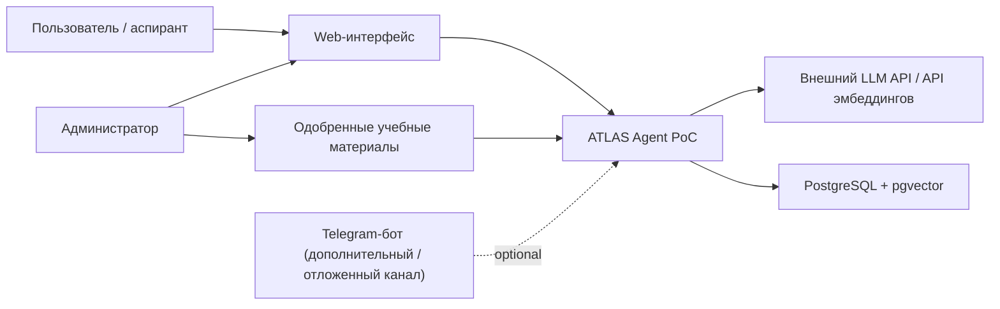

# C4 Context

Диаграмма показывает систему ATLAS Agent как PoC и ее внешнее окружение.

Ключевой акцент PoC:
- основной пользовательский контур идет через `Web UI`;
- Telegram показан как дополнительный и отложенный канал, но не как критическая зависимость основного PoC.
