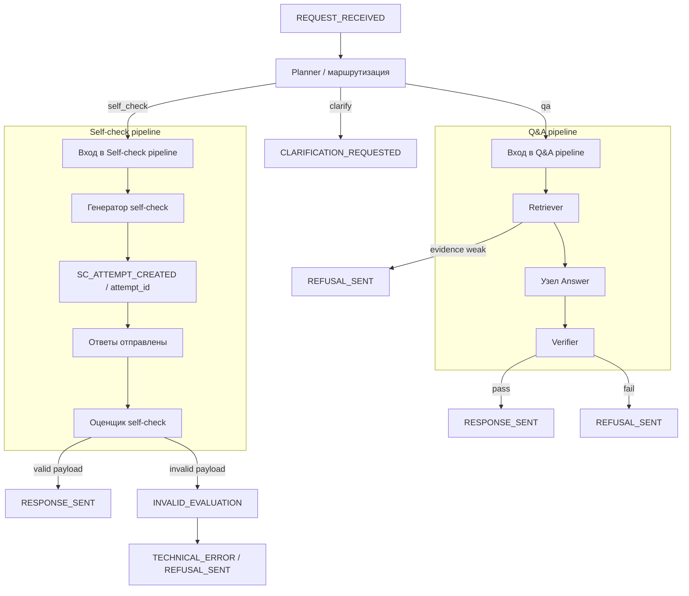

# Workflow Graph

Диаграмма показывает пошаговое выполнение запроса и основные ветки ошибок.

```mermaid
flowchart TD
    start["REQUEST_RECEIVED"] --> planner["Planner / маршрутизация"]
    planner -->|qa| qa_entry["Вход в Q&A pipeline"]
    planner -->|self_check| sc_entry["Вход в Self-check pipeline"]
    planner -->|clarify| clarify["CLARIFICATION_REQUESTED"]

    subgraph qa_pipeline["Q&A pipeline"]
        qa_entry --> retrieve["Retriever"]
        retrieve --> answer["Узел Answer"]
        answer --> verify["Verifier"]
    end

    retrieve -->|evidence weak| refuse1["REFUSAL_SENT"]
    verify -->|pass| response1["RESPONSE_SENT"]
    verify -->|fail| refuse2["REFUSAL_SENT"]

    subgraph sc_pipeline["Self-check pipeline"]
        sc_entry --> scgen["Генератор self-check"]
        scgen --> attempt["SC_ATTEMPT_CREATED / attempt_id"]
        attempt --> submit["Ответы отправлены"]
        submit --> sceval["Оценщик self-check"]
    end

    sceval -->|valid payload| response2["RESPONSE_SENT"]
    sceval -->|invalid payload| invalid["INVALID_EVALUATION"]
    invalid --> tech_or_refuse["TECHNICAL_ERROR / REFUSAL_SENT"]
```
